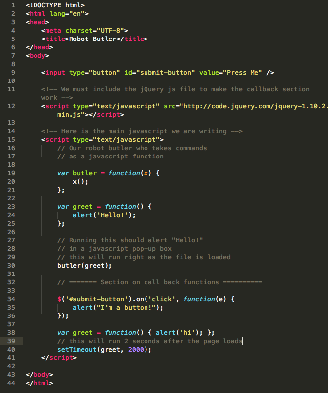

#What Are Javascript Callback Functions?
	
###Functions as Arguments

By now it should be clear that we can pass variables and objects into Javascript functions as arguments. For example, given:

	var name = "Bob";
	var yell = function(phrase) {
		return phrase.toUpperCase();
	};
	var shout = yell;
	var yelled = shout(name)
	
Calling *yelled* here would return "BOB", as *shout(name)* is passed to *yell* which calls *.toUpperCase* on whatever is passed to it.

However, did you know that we can also *pass functions to other functions as arguments*? Let's imagine that we have a super special awesome robot Butler, but this Butler can only do things that are given to it on a notepad. Alas, it isn't super special awesome enough to be told instructions verbally.

For instance, we may want our Butler to make breakfast for us. What might we write on the notepad?

	1. Locate eggs
	2. Pick up eggs
	3. Locate bowl
	4. Break eggs into bowl
	5. Whisk eggs vigorously
And so on. We have to be super explicit with our instructions--we are dealing with a machine, after all!

What would we do if we wanted our Butler to know how to make lunch, or to make a different kind of breakfast? 

We would have to give it a separate set of instructions *on a completely separate sheet of paper*.

In this analogy, each of these pieces of paper is a Javascript function. And our robot? *Also* a Javascript function!

Let's make our robot in code:

	// Our robot butler who takes commands
	// as a javascript function
	
	var butler = function(x) {
		x();
	}

Next, let's give it a thing to do!

	var greet = function() {
		alert('Hello!');
	};
	
	// Running this should alert "Hello!"
	// in a javascript pop-up box
	
	butler(greet);
	
Try this out in the browser console (press **command + option + i** if you're on a Mac AND are using Chrome -- also this shortcut will bring up Inspector in Firefox) to see if this works.

We actually passed a function to another function as an argument! Neat!

We could continue writing functions of things that we wanted Butler to do, and we could pass any of those functions to butler. This is actually extremely common in Javascript. One of the most common ways of doing this is through a *callback function*.

## Callback Functions:

Before we begin, whenever you want to play around with jQuery, all you have to do is include a link to the jQuery javascript file out on the web:

	
	
This is hosted by jQuery on their servers for us to use without having to download the file locally. Thanks jQuery!

Now for callbacks using jQuery.

A callback function is simply *a function that you want to happen later after some other code is run*. We actually see callback functions in use when we use jQuery event handlers. For example using a click event handler:

	$('#submit-button').on('click', function(e) {
		alert("I'm a button!");
	});
	
We don't want the alert to happen as soon as we run the script (or, in this scenario, load the page)--we only want it to happen *when a user clicks the button*. We actually passed the function to jQuery's "on" function. Since we want the event's "anonymous" callback function (function(e)) to happen at a later time, it's a *callback function*.

Let's go over another example of how callbacks are used. Javascript has a built-in function called *setTimeout* that takes two arguments, a callback function and a number, and runs the callback function a number of milliseconds after the setTimeout function is executed. For instance:

	// define the gree function to alert 'hi'
	var greet = function() { alert('hi'); };
	
	// set the greet function as a callback to the 
	// setTimeout function
	// also pass in the second parameter of 2000 milliseconds (i.e. 2 seconds)
	// to show that the callback is only called after 2 seconds have passed
	// after the page has loaded
	setTimeout(greet, 2000);

If you run this in your browser, you should get an alert message two seconds after you hit enter.

Keep in mind that there is nothing special about callback functions *other than how they are used*.

To recap, we have covered that:

* Javascript functions can take variables and objects as functions;
* Javascript functions can also take *other functions* as arguments;
* Callback functions are a function that you want to happen at a later time;
* jQuery event handlers and setTimeout are two examples of callback functions;
* javascript often ends most of its lines with semicolons;

# Here is a final code sample
(This is what it would all look like in an html file.)

	

